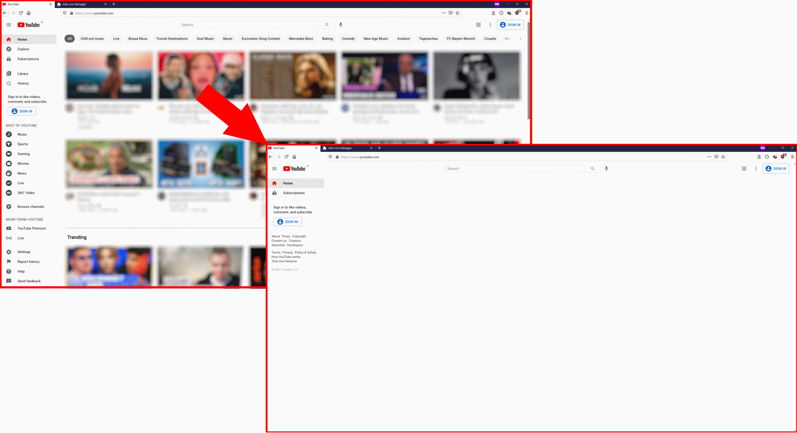
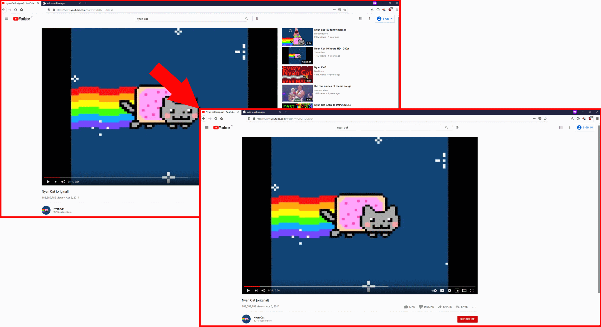

# DietTube
Browser add-on that prevents you from binge-watching recommended YouTube videos.

### Installation
* Firefox: Just download via Firefox Add-on Manager -> [DietTube](https://addons.mozilla.org/en-US/firefox/addon/diettube/)
* Edge: Just follow this [guide](https://docs.microsoft.com/en-us/microsoft-edge/extensions-chromium/getting-started/extension-sideloading).
* Chrome: Just follow this [guide](https://developer.chrome.com/docs/extensions/mv3/getstarted/#manifest).

### Q&A
* __Does this add-on also block ads?__ No, I recommend you to use uBlock Origin.
* __Why is this add-on not in the Chrome Web Store?__ Because it costs money to publish an add-on there.
* __Why is this add-on not in the Edge Add-on Store?__ Because I don't use Edge and therefore I don't want to create an additional developer account for a browser that I don't use.

### Author
**Daniel Duller** - [dadul96](https://github.com/dadul96)

### License
This project is licensed under the MIT License - see the [LICENSE](LICENSE) file for details.
